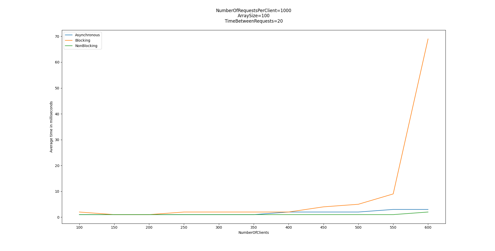
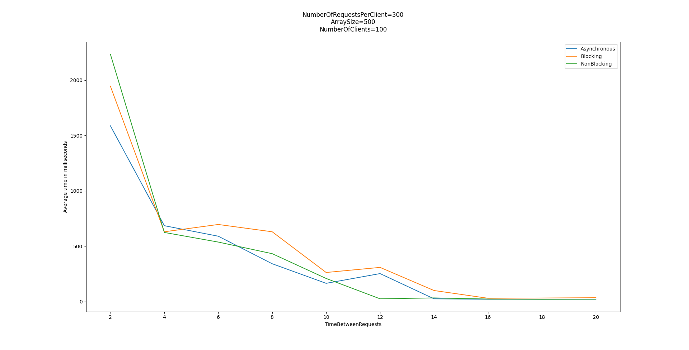

# Бубнов Данил. Отчет

## Особенности измерений	

На каждого клиента создается два потока: один поток отправляет сообщения с интервалом, другой получает от сервера результаты. Каждое сообщение содержит id, чтобы получающий поток мог понять, что за сообщение пришло (для корректного измерения времени).

На сервере измерение времени обработки начинается уже после приема сообщения и заканчивается перед началом его отправки.  

## Мысли

Архитектуры отличаются только тем, как они принимают запросы и как их отправляют обратно. У всех архитектур обработка (сортировка) одинаковая, производится в ThreadPool фиксированного размера. Поэтому смысла тестировать и сравнивать на слишком больших массивах нет, так как обработка будет занимать существенно больше времени, чем прием и отправка. 

Все результаты получены с помощью моего ноутбука, поэтому в измерениях есть некоторая доля погрешности (ноутбук не может долгое время задействовать все ядра на 100%, поэтому в какой-то момент начинает троттлить, а это негативно сказывается на результатах). 

Точно можно сказать, что в среднем прием и отправка запросов у Блокирующей архитектуры происходит медленнее (это видно на графиках "Маленькие массивы и переменное число клиентов"), особенно плохо ей становится при большом числе клиентов. Скорее всего эта разница есть из-за переключения между потоками (в остальных 2 архитектурах его нет).

В остальных же измерениях все архитектуры ведут себя плюс-минус одинаково, особенно если число клинтов не слишком высокое. Неблокирующая архитектура ведет себя чуть более стабильно, чем остальные, часто оказывается лучшей и почти никогда не оказывается худшей (если и оказывается, то скорее всего из-за того, что я её запустил, когда процессор уже устал).

## Графики для метрики "Время обработки запроса клиента на сервере"

### Большие массивы и переменное число клиентов
 

### Маленькие массивы и переменное число клиентов (с интервалом 30ms)

### Маленькие массивы и переменное число клиентов (с интервалом 20ms)

### Переменное число элементов в массиве

### Переменный промежуток времени между отправками

## Графики для метрики "Среднее время одного запроса на клиенте"

### Большие массивы и переменное число клиентов
 

### Маленькие массивы и переменное число клиентов (с интервалом 30ms)

### Маленькие массивы и переменное число клиентов (с интервалом 20ms)

### Переменное число элементов в массиве

### Переменный промежуток времени между отправками

